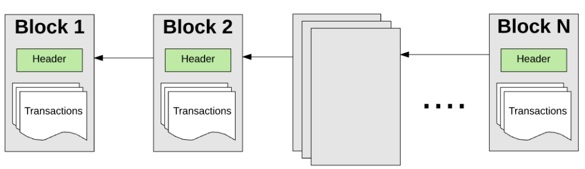
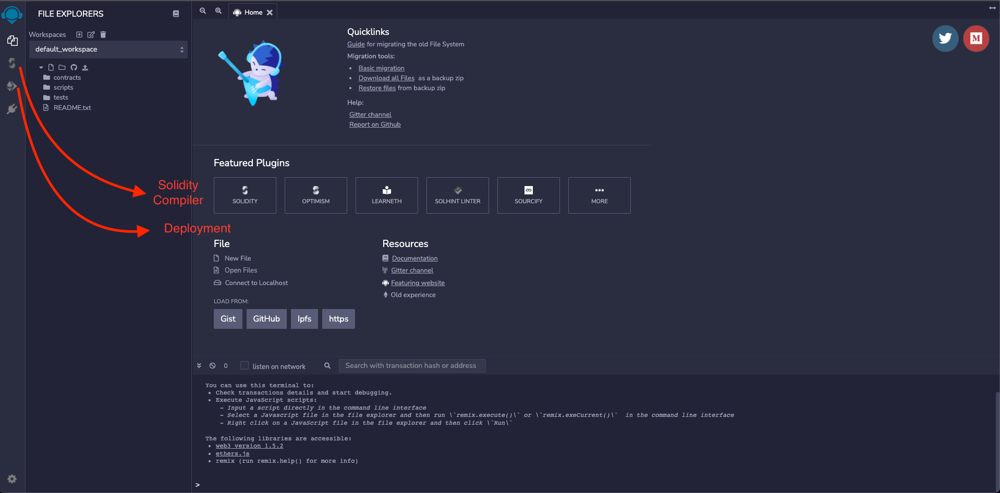
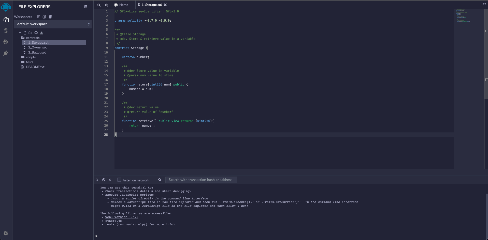

# Meta-Blockchain-Learn
2023-1학기 메타버스 블록체인 공부
https://learnweb3.io/

## 신입생 (Freshman)
### Basic Programming (LearnWeb3)
#### 소개
Web3에서 앱 구축을 하기 위해서는 Web2에 대한 지식이 필요
Web3 = Web2의 확장판

#### Frontend Technologies
프론트엔드는 사용자가 상호작용하는 인터페이스
웹의 프론트엔드는 웹사이트
모바일과 데스크톱의 앱들도 프론트엔드에 예
 
    < 문제 >
    What is a fronted? (프론트엔드란 무엇인가?)
    - ✔ Interface with which an user innteracts (사용자가 상호작용하는 인터페이스)
    - Receives requests from the clients and contains the logic to send the appropriate data back (클라이언트로부터 요청을 수신하고 적절한 데이터를 다시 전송하는 로직을 포함)

#### Backend Technologies
백엔드는 프론트엔드와 상호작용하는 서버
웹의 백엔드는 웹사이트의 서버
벡엔드는 소프트웨어의 작동을 가능하게 하면서도 사용자가 직업 액세스 할 수 없는 부분
사용자 데이터, 비즈니스 로직, 데이터베이스, 인증, 권한, 암호화, 파일 저장 등

프론트엔드는 해당 데이터를 시각적으로 표현하고 사용자가 특정 작업을 수행할 수 있도록 하는데만 사용
백엔드는 클라이언트의 요청을 수신하고 적절한 데이터를 송신하는 로직
Python, Java, Javascript, Go, Rust...

웹에서는 일반적으로 특정 데이터를 요청하거나 특정 작업을 수행하도록 요청하는 요청을 HTTP으로 인터넷을 통해 백엔드 서버로 전송하고, 백엔드는 요청을 등록후 다시 보냄
이 과정에서 Back과 Front는 코드를 재사용하고 지식을 공유할 수 있도록 백엔드도 자바스크립트를 이용

    < 문제 >
    What is a backend? (백엔드란 무엇인가?)
    - Interface with which an user interacts  (사용자가 상호작용하는 인터페이스)
    - ✔ Receives requests from the clients and contains the logic to send the appropriate data back (클라이언트로부터 요청을 수신하고 적절한 데이터를 다시 전송하는 로직을 포함)

##### 필수로 읽기
- What is a backend? ( 백엔드란 무엇입니까? )
###### 백엔드 웹 아키텍처
- 서버란?
    요청을 수신하는 컴퓨터
    단순히 들어오는 요청을 수신 대기하는 컴퓨터로 특정 목적을 위해 만들어지고 최적화된 컴퓨터가 존재하지만
    네트워크에 연결된 모든 컴퓨터가 서버 역할을 할 수 있다.
    실제 개발할때 자신의 컴퓨터를 서버로 사용하는 경우 다수

- 앱의 핵심 기능
    서버는 HTTP 동사와 URI(Uniform Resource Identifier)를 기반으로 다양한 요청에 응답하는 방법에 대한 로직이 포함된 앱을 실행
    HTTP와 URI의 쌍을 라우트라고 하고 요청에 따라서 이들을 매칭하는것이 라우팅

- 서버 응답 종류
    다양한 현태로 제공하는데 서버는 HTML 파일을 제공하거나 JSONM으로 데이터를 전송하고 HTTp상태 코드만 전송할 수 있다.

- 데이터 베이스를 왜 사용하는가?
    데이터베이스는 일반적으로 웹의 백엔드에서 사용된다.
    데이터를 메모리에 영구적으로 저장할 수 있는 인터페이스를 제공하는데
    데이터베이스에 데이터를 저장하면 서버 CPU의 주 메모리 부가가 줄고 서버가 충돌하거나 전원이 끊켜도 데이터를 검색하는 것이 가능하다.
    서버에 많은 요청이 들어오면 데이터베이스 쿼리가 필요할 수 있는데 클라이언트가 데이터베이스에 저장된 정보를 요청하거나 클라이언트가 데이터베이스에 새로운 정보를 저장하도록 요청할 수 있다.

- 웹 API란?
    API는 서로 다른 소프트웨어 구성 요소 간에 명확하게 정의된 통신 방법의 모음이다
    웹 API는 백엔드에서 만든 인터페이스 즉 엔드포인트와 이런 엔드포인트가 노출하는 리소스의 모음
    웹 API는 처리할 수 있는 요청 유형에 따라서 정의되는데 정의된 경로와 클라이언트가 해당 경로에 도달한 후 받을 수 있는 응답 유형에 의해서 결정

    하나의 API를 사용해서 여러 프론트엔드에 데이터를 제공하는 것이 가능하다.
    데이터를 보는 방법을 실제로 지정하지 않아도 데이터를 제공할 수 있고 데이터를 보기 위해서 여러 다른 HTML 페이지 또는 모바일 앱을 만들 수 있다.

- 요청-응답 주기의 원칙
    서버는 일반적으로 요청없이는 응답하지 않는다
    컨텐츠를 찾을 수 없음을 나타내는 404 상태의 코드라도 모든 요청에는 응답이 필요 (그렇지 않는다면 클라이언트는 무한 대기로 정지)
    서버는 요청당 하나 이상의 응답을 보내서는 안된다.

- Mapping out a request (요청 매핑하기)
    클라이언트가 서버에 요청을 보내는 과정을 단계에 따라 예를 들어 설명

        1. 앨리스가 쇼핑 홈페이지에서 쇼핑중. (SuperCoolShop.com)
        스마트폰 커버 사진을 클릭하면 클릭 이벤트가 http://www.supercoolshop.com/products/66432로 GET 요청
        GET은 아무것도 변경하지 않고 데이터만 요청
        URI(Unifrom Resource Identifier)는 리소스를 식별하는데 사용되는 유일한 주소
        URI/products/66432는 클라이언트가 제품에 대한 자세한 정보를 찾고 있으며 66432는 제품의 고유 ID
        (수많은 제품과 이를 필터링할 수 있는 카테고리가 있으니 사실 주소는 더 복잡할 것이지만 위와 같은 방식이 리소스 식별자가 작동하는 일반적인 원칙)

        2. 앨리스의 요청으로 인터넷을 통해 SuperCoolShop의 서버중 하나로 이동
        이동거리가 있기 때문에 이 단계는 프로세스에서 느린 단계중 하나
        전 세계 사용자가 있는 주요 웹사이트는 다양한 서버가 있고 사용자와 가까운 서버로 이동

        3. 사용자의 요청을 적극적으로 수신하고 있는 서버가 앨리스의 요청을 받는다

        4. 해당 요청과 일치하는 이벤트 리스너(HTTP verb(메소드) : GET 및 URI : /products/66432)가 트리거.
        요청과 응답 사이 서버에서 실행되는 코드를 미들웨어라고 한다

        5. 요청을 처리할 때 서버는 이 스마트폰 케이스 제품 에 대한 자세한 정보를 얻기 위해서 데이터베이스 쿼리를 수행한다.
        제품의 이름, 가격, 리뷰 몇 개, 이미지 경로를 제공하는 문자열등 앨리스가 보고 싶어하는 정보가 포함되어 있다.

        6. DB 쿼리가 실행되고 데이터베이스가 요청된 데이터를 서버로 다시 보낸다
        쿼리를 검색하는 과정은 프로세스에서 느린 단계중 한가지
        정적 메모리에서 읽고 쓰는 작업은 느리고 DB가 원래 서버가 아닌 다른 컴퓨터에 있을 수 있기 때문
        이 쿼리 자체가 인터넷을 통하여 이뤄져야 할 수 있을 수 있다

        7. 서버는 데이터베이스에서 필요한 데이터를 수신하고 응답을 구성하여 클라이언트에 보낼 준비가 완료
        앨리가스 관심있는 휴대폰 케이스에 대한 자세한 정보를 보여주기 위해서 브라우저가 필요한 모든 정보가 포함되고
        응답헤더에는 요청이 성공하였다는 HTTP 상태 코드 200이 포함되어 있다.

        8. 응답은 인터넷을 통하여 앨리스의 컴퓨터로 전송되고

        9. 앨리스의 브라우저는 응답을 수신하고 해당 정보를 사용하여 앨리스가 최고종적으로 보는 뷰를 생성및 렌더링하게 된다
- Building an API with Node.js and Express ( Node.js 및 Express로 API 구축 )
- Building an API connected to a database in Node.js ( Node.js에서 데이터베이스에 연결된 API 빌드 )
https://www.freecodecamp.org/learn/back-end-development-and-apis/

    < 문제 >
    What is an API? (API란 무엇인가요?)
    - Interface to save data in a persistent way to memory (데이터를 메모리에 영구적으로 저장하는 인터페이스)
    - ✔ Interface to communicate between different software components. (서로 다른 소프트웨어 구성 요소 간의 통신을 위한 인터페이스.)

    < 문제 >
    What is a database? (데이터베이스란 무엇인가요?)
    - ✔ Interface to save data in a persistent way to memory (데이터를 메모리에 영구적으로 저장하는 인터페이스)
    - Interface to communicate between different software components. (서로 다른 소프트웨어 구성 요소 간의 통신을 위한 인터페이스.)

### 2 - What is a Blockchain? (LearnWeb3)
블록체인은 안전하고 투명한 방식으로 거래를 기록하고 데이터를 저장하는데 사용되는 분산형 디지털 불변의 원장
분산된 노드 네트워크를 기반으로 하며, 노드 네트워크는 단일 진실 소스를 공동으로 유지하며 참여자가 중개자 없이도 시스템과 상호작용할 수 있도록 한다.

블록은 공개 원장인 블록체인에 포함하기 위해서 트랜잭션을 집계하는 컨테이너 구조
체인의 각 블록에는 합의로 알려진 프로세스를 통해서 노드 네트워크에 의하여 확인되고 기록된 트랜잭션이 포함
블록이 체인에 추가되면 변경하거나 삭제 불가능
네트워크의 모든 트랜잭션에 대한 불변의 기록이 생성

블록체인을 만든 개인 또는 그룹은 나카모토 사토시로 2009년에 비트코인 네트워크를 공개하면서 대중화함
비트코인은 암호 화폐 네트워크이며 신뢰할 수 있는 중개인이나 기관 없이 네트워크를 통해 BTC 자산의 전송을 주로 처리하는 동시에
네트워크 자체가 안전하고 해킹할 수 없도록 보장

    < 문제 >
    Who created Bitcoin? (비트코인은 누가 만들었나요?)
    - ✔ Satoshi Nakamoto (사토시 나카모토)
    - Craig Wright (크레이그 라이트)
    - John McAfee (존 맥아피)

시간이 지남에 따라서 비트코인의 설계는 이더리움과 같이 뛰어난 기능을 갖춘 다른 블록체인 네트워크의 출현에 영감을 주었습니다.

    < 문제 >
    What is a blockchain? (블록체인이란 무엇인가요?)
    - A cryptocurrency (암호화폐)
    - ✔ A distributed database running on a peer to peer network of nodes (노드의 피어 투 피어 네트워크에서 실행되는 분산 데이터베이스)
    - A database run by Satoshi Nakamoto (사토시 나카모토가 운영하는 데이터베이스)

#### State Management (상태 관리) 

블록체인은 처음 시작할때 제네시스 상태로 시작
비트코인의 제네시스 상태는 퍼블릭 네트워크가 시작된 2009년에 발생
이더리움의 제네시스 상태는 2015년에 발생

블록체인의 모든 트랜잭션은 모든 노드에 복제되는 글로벌 상태를 수정한다.

    < 문제 >
    What is a genesis block? (제네시스 블록이란 무엇입니까?)
    - The Book of Genesis on the blockchain (블록체인의 창세기)
    - ✔ The initial state of the blockchain (블록체인의 초기 상태)
    - The first transaction on the blockchain (블록체인의 첫 번째 트랜잭션)


수백만 개의 트랜잭션이 있기 때문에 트랜잭션은 블록으로 그룹화됩니다.
그래서 블록이라는 이름이 붙었습니다.
이러한 블록은 암호학적으로 검증 가능한 방식으로 서로 연결되어 있어 역사적으로 추적이 가능
네트워크의 현재 상태는 제네시스 블록에서 시작하여 지금까지의 각 블록의 정보에 따라서 상태를 전환하여 언제든지 다시 계산 가능

    < 문제 >
    Where are your cryptocurrency assets stored? (암호화폐 자산은 어디에 저장되나요?)
    - In your digital wallet (디지털 지갑에)
    - ✔ In 1000's of blockchain nodes (수천 개의 블록체인 노드에서)
    - In your bank account (은행 계좌에서)
#### Nodes (노드)
p2p(peer to Peer) - 중앙 서버를 거치지도 않고 클라이언트 컴퓨터끼리 직접 통신하는 방식을 통칭

블록체인 네트워크는 컴퓨터 노드의 P2P 분산 네트워크를 통해서 자율적으로 관리된다.
네트워크의 각 노드를 글로벌 트랜잭션 원장의 사본을 보관하는 것으로 간단히 생각할 수 있습니다.
따라서 각 노드는 네트워크에서 발생하는 트랜잭션을 개별적으로 확인 및 감사하고 불법 행위가 없었는지 확인할 수 있다.

마이닝 노드라고 하는 또 다른 유형의 노드는 네트워크에서 생성되는 새로운 트랜잭션을 블록으로 그룹화하고 이를 검증하며 다른 모든 사람이 블록으로 글로벌 원장에 포함하도록 제안하는 역할을 합니다.
채굴은 계산적으로 어렵고 안전하게 수행하는 것이 매우 중요하여 블록이 승인된 채구루자는 노력에 대한 토큰 보상을 받습니다.

    < 문제 >
    What is a miner? (광부란 무엇입니까?)
    - A node responsible for verifying and auditing transactions (트랜잭션을 확인하고 감사하는 노드입니다)
    - Someone mining for gold underground (지하에서 금을 채굴)
    - ✔ A node responsible for proposing new blocks - verifying transactions - and auditing transactions 
    (새로운 블록을 제안하고, 트랜잭션을 검증하고, 트랜잭션을 감사하는 노드를 담당합니다)

    < 문제 >
    Why do miners do hard work to secure the network? (블록체인 네트워크의 노드란 무엇입니까?)
    - ✔ For block rewards (블록 보상의 경우)
    - For goodwill (선의의 보상)
    - For political reasons (정치적 이유)

블록체인의 사용은 각 가치 단위가 한 번만 전송되었음을 확인하고 Satoshi Nakamoto가 제시한 독창적인 메커니즘은 오랜 탈중앙화 이중 지출 문제를 해결했습니다.

    < 문제 >
    What is a node in a blockchain network? (블록체인 네트워크의 노드란 무엇입니까?)
    - A programming language (프로그래밍 언어)
    - A cryptocurrency token (암호화폐 토큰)
    - ✔ A computer running the blockchain software (블록체인 소프트웨어를 실행하는 컴퓨터)

#### Decentralization (분산)
피어 투 피어 노드 네트워크에 데이터를 저장함으로써 블록체인은 분산형 네트워크입니다
이는 데이터를 중앙 집중식으로 저장하는 기존 접근 방식에 비해 상당한 이점이 있습니다.
중앙 집중화 문제의 중요한 예가 있습니다.

중앙 집중식 시스템의 데이터 유출은 많은 데이터를 노출시킵니다.
중앙 집중식 기관은 언론을 검열하고 차단할 수 있습니다.
중앙 권한에 대한 의존은 업스트립 문제가 다운스트림 소비자에게 영향을 미친다는 것을 의미합니다 
(AWS가 다운되면 대부분의 인터넷이 다운됨을 의미함)

    < 문제 >
    What does P2P mean? (P2P 무엇을 의미 합니까?)
    - ✔ Peer to Peer (피어 투 피어)
    - Product to Product (제품 대 제품)
    - Password to Private Key (개인 키에 대한 암호)

반면에 분권화는 정반대의 이점을 가져옵니다.
    - 귀하를 검열할 수 있는 단일 기관이나 중개인이 없으므로 검열이 없습니다.
    - 전체 네트워크가 전 세계 1000개 노드에서 실행되므로 가동 중지 시간 없음
    - 높은 공격 저항력으로 인해 데이터를 조작하거나 파괴할 수 없습니다.

사용 사례
- 암호화폐
- 스마트 계약
- 탈중앙화 금융
- 노름
- 공급망 추적
- 위조 방지
- 데이터 프라이버시
- 분산 거버넌스
- 확인 가능한 자산 소유권

    < 문제 >
    What are valid use cases for blockchain technology? (블록체인이 분할될 때의 용어는 무엇입니까?)
    - Storing and transferring assets (자산 저장 및 전송)
    - Participating in decentralized governance (탈중앙화 거버넌스에 참여)
    - Tracking food items across the supply chain (공급망 전반에서 식품 품목 추적)
    - ✔ All of the above (위의 모든 항목)

#### Resources (자원)
블록체인에 대해 자세히 알아보려면 다음 리소스를 적극 권장합니다.

Must Watch
- But how does bitcoin actually work? by 3Blue1Brown (youtube.com/watch?v=bBC-nXj3Ng4)
- Blockchain Demo by Anders Brownworth (https://andersbrownworth.com/blockchain/)

    < 문제 >
    What is the term for when a blockchain splits? (블록체인이 분할될 때의 용어는 무엇입니까?)
    - ✔ Fork (포크)
    - Spoon (숟가락)
    - Merge (병합)
    - Cut (컷)

### 3 - What does Web3 Mean?
#### Web3
##### Web1 (1980년 ~ 2000 년대 초반)
인터넷의 첫 번째 단계인 Web1은 주로 일상 소비자에게 온라인 콘텐츠와 정보를 제공하는 것이었습니다.
소비자는 정보와 컨텐츠를 읽을 수만 있고 상호작용은 불가능하였다
즉 읽기 전용

##### Web2
우리가 알고 있는 인터넷 버전
Web1이 읽기 전용이라면 Web2는 읽기, 쓰기
동적이게 되었고 사용자는 인터넷에서 스스로 컨텐츠를 소비하고 상호작용하고 만들 수 있다

스마트폰 사용이 폭발적으로 증가했으며 대부분의 인터넷 사용은 이러한 회사(4대 거대 기업 : apple, amazon, facebook, google)가 만든 모바일 앱과 하드웨어를 통해서 이뤄졌다.
더 많은 사람이 인터넷에 참여할 수 있다는 것을 의미하지만 디지털 플랫폼에 통제되고 있다는 것을 의미

이것이 문제인 이유는 중앙 집중식 인터넷에서 apple은 모든 유료 앱 다운로드 및 인앱 구매에 대해 30%를 삭감할 수 있고 Twitter 및 Facebook은 미국 대통령의 플랫폼을 탈피할 수 있으며 소비자는 개인 정보 보호 및 보안에 취약해지며 그 어느 때보다 온라인 정보를 제어할 수 있습니다.

    < 문제 >
    Web2 applications tend to be centralized (Web2 애플리케이션은 중앙 집중화되는 경향이 있습니다.)
    - ✔True
    - False

Web2 전체에서 많은 데이터 침해가 발생하여 개인 데이터에 대한 보안 및 개인 정보 보호가 저하되는 것을 볼 수 있다.
사용자의 데이터가 유출되면 신원 도용, 인신 공격등의 피해자가 되기 쉽다.

    < 문제 >
    It is easier for data breaches to happen in Web2 applications (Web2 애플리케이션에서 데이터 유출이 더 쉽게 발생합니다.)
    - ✔True
    - False

##### Web3
Web3는 탈중앙화 인터넷
Web3에서 인터넷은 온라인으로 공유되며 중앙 집중식 개체가 소유하지 않고 "우리"집합체에 의해 관리된다.
Web3 세계는 그 기반에 오픈 소스 프로토콜이 있는 세계
인터넷 서비스와 제품을 재설계하여 기업이 아니라 사람에게 혜택을 준다

    < 문제 >
    Web3 does not require permisson to enter (Web3는 입장 허가가 필요하지 않습니다.)
    - ✔ True
    - False

Web3는 오늘날 우리가 알고 있는 웹을 탈중앙화, 분산, 개방, 무신뢰 및 무허가로 만들어 향상시킨다

    < 문제 >
    Web3 applications tend to be centralized (Web3 애플리케이션은 중앙 집중화되는 경향이 있습니다.)
    - True
    - ✔ False

- 시스템을 제어할 수 있는 중앙 권한이 없는 분산된 분산 방식으로 모든 일이 발생하도록 구축되고 있다.
- 개방적이고 접근 가능한 개발자 커뮤니티에 의해 구축되고 전 세계에서 실행되는 오픈 소스 소프트웨어인 '개방형'
- 네트워크 자체가 참가자가 신뢰할 수 있는 제 3자 없이 공개적으로 또는 비공개로 상호 작용할 수 있도록 한다는 점에서 '무신뢰'
- 사용자와 공급자 모두 관리 기관의 승인 없이 참여할 수 있다는 점에서 '무허가'

    < 문제 >
    Web3 applications tend to be distributed (Web3 애플리케이션은 분산되는 경향이 있습니다.)
    - ✔ True
    - False

    < 문제 >
    Web3 does not require trust on a central authority (Web3는 중앙 기관에 대한 신뢰가 필요하지 않습니다.)
    - ✔ True
    - False

##### 요약
Web1 : 읽기
Web2 : 읽기, 쓰기
Web3 : 읽기, 쓰기, 소유

    < 문제 >
    Web3 is open and inclusive for all (Web3는 모두에게 개방적이고 포괄적입니다.)
    - ✔True
    - False

##### 필수 읽기
(Web3란? 미래 분산형 인터넷)
###### 웹 2.0 수익 창출 및 보안

- 앱의 수익화
    1. 회사에서 앱 출시
    2. 가능한 한 많은 사용자를 온보딩합니다.
    3. 그런 다음 사용자 기반에서 수익을 창출합니다.
    일반적으로 이런 프로세스로 진행된다.

    Web2 회사의 경우 더 많은 데이터가 개인화된 광고로 이어진다.
    이것은 더 많은 클릭으로 유도되고 이로 인해 더 많은 광고 수입으로 이어진다.
    사용자 데이터의 활용 및 중앙 집중화는 오늘날 우리가 알고 있는 사용하는 웹이 작동하도록 설계되는 방식의 핵심

- 보안 및 개인 정보 보호
    웹2는 반복적으로 데이터 유출을 경험
    웹2는 데이터나 저장 방법을 제어할 수 없다.
    실제로 회사는 사용자의 동의 없이 사용자의 데이터를 추적하고 저장하는 경우가 많다.
    
    중앙 집중식 서버를 사용하면 정부가 적합하다고 생각하는 대로 애플리케이션을 쉽게 개입, 제어 또는 종료할 수 있다.

    Web3는 처음부터 설계하고 상호 작용하는 방식을 근복적으로 다시 생각해서 이런 단점을 해결하는 것이 목표

###### 웹 3.0이란?
핵심은 탈중앙화
Web3의 특성
- Verifiable (검증 가능(증명))
- Trustless (남을 믿지 않는)
- Self-governing (자율 관리)
- Permissionless (무허가)
- Distributed and robust (분산 및 견고성)
- Stateful(상태 저장)
- Native built-in payments (기본 내장 결제)

    < 문제 >
    Web3 is controlled by a few trusted entities (Web3는 신뢰할 수 있는 소수의 기관에 의해 제어됩니다.)
    - True
    - ✔False

### 4 - What is ETH?
#### What is ETH? (이더리움이란 무엇인가?)
이더리움 : 스마트 컨트랙트를 지원하는 탈중앙화된 블록체인
네트워크에서 비트코인 토큰 전송만 지원하는 비트코인과 다르게 보다 더 일반적인 용도로 사용

개발자는 이더리움 가상머신 (EVM)을 통해서 네트워크에서 실행할 수 있는 분산형 애플리케이션, 즉 dapp을 구축
따라서 이더리움의 글로벌 상태는 모든 계정의 잔액뿐만 아닌 각 dapp의 상태도 포함

dapp은 이더리움의 프로그래밍 언어인 Solidity를 사용하여 작성
솔리디티를 이용해서 스마트 콘트랙트를 작성하고 이더리움 네트워크에 스마트 콘트랙트를 배포할 수 있다.

    < 문제 >
    How are smart contracts executed? (스마트 컨트랙트는 어떻게 실행되나요?)
    - On Ethereum servers (이더리움 서버에서)
    - ✔ On the Ethereum Virtual Machine (EVM) (이더리움 가상 머신)
    - Jeff Bezos runs them (제프 베조스가 운영)

이더리움은 네트워크의 모든 컴퓨터에서 지분 증명(pos)을 통해서 합의를 유지한다
2022년 9월에 도입된 Serenity 패치(세레니티 패치)를 통해서 이더리움은 Proof of Work(작업 증명)에서 Proof of Stake (지분 증명) 매커니즘으로 변경

    < 문제 >
    Ethereum currently uses which consensus algorithm? (이더리움은 어떤 합의 알고리즘을 사용하나요?)
    - Proof of Work (작업 증명)
    - ✔ Proof of Stake (지분 증명)
    - Proof of Authority (권한 증명)

    < 문제 >
    In the Serenity patch... Ethereum moved from Proof of Work to Proof of Stake (Serenity 패치에서 이더리움은 작업 증명에서 지분 증명으로 이동했습니다.)
    - ✔ True
    - False

#### 이더리움의 기초
##### 역사
이더리움은 원래 비트코인의 공동 창립자이자 젊은 프로그래머였던 비탈릭 부테린이 제안하였다
2007년 부터 2010년까지 월드 오브 워크래프트를 즐겨했지만 원하지 않던 패치로 그만둠
2011년 비트코인을 알게 되었고 이에 매료됨
이에 기여하고 싶어서 기사당 몇 비트코인을 받는 대가로 비트코인에 대한 기사를 쓰기 시작
2011년 말 비트코인 매거진을 공동 설립하고 암포화폐에 전념
전세계를 돌며 다양한 암호화폐 프로젝트를 살펴보고 튜링이 완선된 범용 플밍 언어를 블록체인에 통합하면 대부분의 프로젝트 기능을 일반화할 수 있다는 사실을 알게 됨

다른 개발자들과 비트코인 개발자들에게 블록체인 기술이 화폐 거래소보다 많은 영향을 미칠 수 있으며 블록체인에 범용 언어가 필요하다고 설득
그리고 튜링이 완성된 솔리디티라는 언어로 새로운 블록체인 플랫폼을 개발하였고 이것이 이더리움

2014년 공개적으로 발표되었고 핵심 팀은 비탈릭 부테린, 미하이 앨리스, 안토니 디 이오리오, 찰스 호스킨슨, 조 루빈, 개빈 우드로 구성
몇달뒤 개발 자금을 위해 이더리움 토큰에 대한 초기 코인 공개(ICO)를 진행
1800만 달러에 해당하는 31000 BTC를 모금하였고 이더리움 재단을 설립하여 스위스에 기반을 둔 비영리 재단으로 설립

##### 이더란 무엇인가?
이더리움에는 Ether, ETH라는 통화가 있다, 이 토큰을 이더리움 네트워크에서 거래에 대한 수수료로 지불하는데 필요
    < 문제 >
    What is the native currency of Ethereum? (이더리움의 기본 통화는 무엇인가요?)
    - NEAR
    - MATIC
    - ✔ ETH
    - BTC

##### 스마트 컨트랙트란 무엇인가?
중앙 코디네이터 없이 이더리움 네트워크의 모든 컴퓨터에서 복제되고 처리되는 작은 컴퓨터 프로그램
이를 사용하면 컴퓨터 코드에 의해 자동으로 실행 될 수 있는 콘트랙트를 프로그래밍할 수 있다.

    < 문제 >
    If you write a smart contract on the Ethereum mainnet... it will be replicated and processed on all the computers on the Ethereum main network.
    (이더리움 메인넷에서 스마트 콘트랙트를 작성하면 이더리움 메인 네트워크의 모든 컴퓨터에서 복제되어 처리됩니다.)
    - ✔ True
    - False

이더리움의 범용적인 특성으로 이더리움 블록체인에서 실행되는 보안과 탈중앙화의 이점을 그래도 이어받은 다양한 애플리케이션이 이더리움 위에 구축 될 수 있다.

##### ERC20 Tokens
이더 외에도 사람들은 자신의 통화를 만들고 사용하는것이 가능
이에 가장 맞는 형태는 ERC20 토큰
특정 표준에 맞는 스마트 콘트랙트이다

개발자는 표준을 넘어서 확장할 수 있지만 자체 토큰을 발행할때는 최소한의 요건을 충족해야 한다.
표준화를 통해서 디지털 지갑은 토큰을 생성할 때마다 특수 코드를 만들 필요 없이 모든 유형의 토큰을 쉽게 지원할 수 있다.

    < 문제 >
    You can create your own ERC-20 token without the permission of Ethereum (이더리움의 허가 없이도 자신만의 ERC-20 토큰을 생성할 수 있습니다.)
    - ✔ True
    - False

###### ERC721 and ERC1150 Tokens
이들은 대체 불가능한 토큰 NFT라고 부른다,
이 두 표준은 ERC20과 유사하게 NFT를 생성할때 충족해야 하는 요건에 대한 기준선
이 둘은 비슷한 이점을 제공하고 지감과 NFT 마켓플레이스가 이 두 표준 중 하나를 따르기 때문에 모든 NFT 컬렉션과 즉시 호환될 수 있다. 

##### 필수 읽기
https://bitsonblocks.net/2016/10/02/gentle-introduction-ethereum/

##### 추천 읽기
https://ethereum.org/en/whitepaper/
https://cointelegraph.com/explained/erc-20-tokens-explained
https://www.youtube.com/watch?v=ZE2HxTmxfrI
https://blockgeeks.com/guides/smart-contracts/
https://www.investopedia.com/news/what-erc20-and-what-does-it-mean-ethereum/

    < 문제 >
    Which statement best describes Proof of Work? (작업 증명을 가장 잘 설명하는 문장은 어느 것입니까?)
    - Miners with the most currency are allowed to mine and add blocks to the blockchain
    (가장 많은 화폐를 보유한 채굴자는 블록체인에 블록을 채굴하고 추가할 수 있습니다.)

    - ✔ Miners compete to solve computational puzzles. The winner of this competition gets to add a block to the blockchain.
    (마이너들은 컴퓨터 퍼즐을 풀기 위해 경쟁합니다. 이 경쟁의 우승자는 블록체인에 블록을 추가할 수 있습니다.)

    - Miners work to compute an EVM routing problem. The first miner to solve the problem gets to add blocks to the Blockchain
    (채굴자는 EVM 라우팅 문제를 계산하기 위해 노력합니다. 문제를 가장 먼저 푸는 채굴자가 블록체인에 블록을 추가할 수 있습니다.)

    < 문제 >
    Who's "Block time" is shorter? (누구의 '차단 시간'이 더 짧은가요?)
    - Bitcoin
    - ✔ Ethereum

    < 문제 >
    Who's "Block size" is bigger? (누구의 "블록 크기"가 더 큰가요?)
    - ✔ Bitcoin
    - Ethereum

### 5 - Setting up a crypto wallet 
#### 주소란 무엇인가?
조스는 블록체인에서 계정을 나타내기 위해서 암호화를 사용하여 생성된 택스트 문자열
이주소는 다른 사람에게 공유할 수 있고 공유되어도 안전하다
이를 통해서 자금을 송수신 가능하고 기본적으로 주소는 블록체인에서 고유 식별자이며 계정의 의미
ex> 0x01573Df433484fCBe6325a0c6E051Dc62Ab107D1.
    < 문제 >
    What is an address? (주소란?)
    - An address represents a crypto currency (주소는 암호화폐 통화를 나타냅니다)
    - ✔ An address represents your account on the blockchain (주소는 블록체인에서 내 계정을 나타냅니다)
    - an address represents your crypto balance (주소는 암호화폐의 잔액을 나타냅니다)

    < 문제 >
    Which one of the following is an Ethereum address? (다음 중 이더리움 주소는?)
    - bc1qxy2kgdygjrsqtzq2n0yrf2493p83kkfjhx0wlh
    - ✔ 0x71C7656EC7ab88b098defB751B7401B5f6d8976F
    - @LearnWeb3DAO

#### 개인키란?
주소에 대응하는 것으로 각 주소는 연결된 개인키가 존재
이름에서 알 수 있듯이 개인키는 개인적인 것이며 공유하면 안된다

주소의 소유권을 증명할 수 있는 여러 개의 문자와 숫자가 포함된 강력한 비밀번호
개인키를 가진 사람은 누구나 내 주소로 거래가 가능
즉 다른 사람이 내 개인키를 안다면 이를 통해 자금을 움직이는것이 가능
ex> E9873D79C6D87DC0FB6A5778633389F4453213303DA61F20BD67FC233AA33262

주소를 계정의 사용자 이름이라고 생각한다면 개인 키는 계정의 비밀번호
주소를 공유하는것은 문제가 안되고 괜찮지만 개인키는 절대로 금물

    < 문제 >
    What is a private key? (개인키란?)
    - ✔ Private key is like a strong password for your account (개인 키는 계정의 강력한 비밀번호)
    - Private key is another name for an address (개인 키는 주소의 다른 이름)
    - Private key refers to a crypto wallet (개인 키는 암호화폐 지갑을 의미)

#### 주의
블록체인은 탈중앙화되어 있기 때문에 비밀번호 분실 옵션이 없다
개인 키를 분실하면 계정에 액세스할 수 없다
개인키를 도용하여 자금을 훔쳐가더라도 조치를 취할 수 없다

개발자의 경우 자체 스마트 컨트랙트를 이더리움 네트워크에 배포하는 등 특정 트랜잭션을 수행하기 위해서 코드베이스의 일부로 개인키를 사용하는 경우가 많다
아직 배우는 단계라면 자금을 저장하는데 사용하는 계정과 개발용 계정을 별로로 두는것이 좋다.
실수로 코드베이스를 공개적으로 공유하는 경우가 많고 해커가 코드 베이스의 개인키를 보고 자금을 탈취할 수 있다.

    < 문제 >
    What should you do with your private key? (개인키로 무엇을 해야 하나요?)
    - You should share your private key with everyone (개인 키를 모든 사람과 공유)
    - You should share your private key with only your friends and family (개인키를 친구 및 가족과 공유)
    - ✔ You should never share your private key (개인키를 공유하면 안됨)

#### 시드 문구란?
시드문구는 마스터 비밀번호로 비밀번호의 비밀번호
암호 지갑은 여러 블록체인 계정을 관리할 수 있는 일종의 암호관리자
개인키가 단일 계졍의 암호인 경우 시드 문구는 해당 지갑의 마스터 암호와 비슷 

    < 문제 >
    What is a seed phrase? (시드 문구란 무엇인가?)
    - Seed phrase is like a password for your address (시드 문구는 주소의 비밀번호)
    - ✔ Seed phrase is like a master password for your crypto wallet (암호화폐 지갑의 마스터 비밀번호)
    - Seed phrase is like a password for private key (개인키의 비밀번호)

새 암호 지갑을 만들때 안전하게 저장하고 백업해야 하는 시드 문구가 생성된다.
해당 지갑 내부에서 생성하는 모든 새 계정은 모두 시드 문구에 연결
이 하나의 시드 문구는 각각에 대해 동일한 개인 키와 주소를 사용하여 항상 동일한 계정을 생성

예를들어 지갑을 만들고 그안에 5개의 계정을 만들면 시드문구가 5개 모두 관리
새 지갑으로 전환하려면 개별 개인 키를 사용하여 5개의 지갑으로 개별적으로 가져와야 한다.

또 시드 문구를 사용해서 가져오면 동일한 5개의 계정이 재생성
ex> dove lumber quote board young robust kit invite plastic regular skull history

    < 문제 >
    What is an example of seed phrase? (시드 문구의 예는 무엇인가요?)
    - correct horse battery staple 
    - Y123456789
    - ✔ jealous expect hundred young unlock disagree major siren surge acoustic machine catalog

#### 암호화폐 지갑이란
계정 및 주로 개인 키의 관리자
탈중앙화 애플리케이션과 상호작용이 가능하고 지갑을 통해서 dapp에 연결하여 블록체인에 구축된 모든 애플리케이션에 대한 싱글사인온 역할을 한다
learnWeb3에서도 대시보드에서 암호지갑을 연결할 수 있다.

    < 문제 >
    What is a crypto wallet? (암호화폐 지갑이란 무엇인가요)
    - Crypto wallet manages your seed phrases (시드 문구를 관리)
    - ✔ Crypto wallet manages the private keys associated with your addresses (주소와 연결된 개인 키를 관리)
    - Crypto wallet manages your crypto balance (암호화폐 잔액을 관리)

    < 문제 >
    What is MetaMask? (메타 마스크란?)
    - ✔ An Ethereum wallet (이더리움 지갑)
    - A Bitcoin wallet (비트코인 지갑)
    - A Solana wallet (솔라나 지갑)

    < 문제 >
    Have you downloaded a wallet and set it up? (지갑을 다운로드 하고 설정하였나?)
    - ✔ Yes
    - No

### 6. Setting up the Remix IDE
#### 리믹스란?
https://remix.ethereum.org
이더리움 개발을 위한 오픈 소스 및 데스크탑 통합 개발 환경
이더리움 구축을 시작하는 가장 쉬운 개발도구이며  확장 가능한 플러그인 아키텍처를 제공

    < 문제 >
    What does IDE stand for? (IDE는 무엇인가)
    - ✔ Integrated Development Environment (통합 개발 환경)
    - Intelligent Discord Environment (지능형 디스코드 환경)
    - Intentional Developer Experience (의도적인 개발자 환경) 
    - Irritated Developer Exasperation (짜증나는 개발자의 분노)

Remix는 브라우저에서 직접 솔리디티 코드를 작성할 수 있도록 도와주며, 스마트 컨트랙트를 테스트, 디버깅 및 블록체인에 배포하기 위한 도구를 제공합니다.

    < 문제 >
    Remix allows you to write (리믹스에서 작성할 수 있는 것)
    - Solidity Contracts (솔리디티 컨트랙트)
    - Solidity Tests (솔리디티 테스트)
    - Javascript Scripts (자바 스크립트)
    - ✔ All of the above (위의 모든 항목)

### 리믹스 탐색



솔리디티를 배울 수 있도록 3가지 기본 스마트 계약이 제공된다


어떤 스마트 컨트랙트 프로그래밍 언어를 사용할지 선택할 수 있다

리믹스에 있는 솔리디티를 제외한 다른 언어는 수준이 낮고 중간 컴파일을 위한것으로 하드우ㅞ어가 더 가깝다


    < 문제 >
    Which one of the following is not a panel in Remix? (리믹스의 패널이 아닌것은)
    - File Explorer(파일 탐색기)
    - ✔ Version Control History (버전 관리 기록)
    - Solidity Compiler(솔리디티 컴파일러)

리믹스는 브라우저에서 London Upgrade를 실행하는 이더리움 가상 시뮬레이터(EVM - Ethereum Virtual Machine)이 제공
실제 이더리움 네트워크에 배포된 다른 계약에 의존하지 않는 한 스타트 계약을 빠르게 테스트하고 디버깅할 수 있다.
고맙게도 스토리지 계약은 그렇지 않으므로 바로 여기 Remix VM에서 테스트

    < 문제 >
    Which of the following environments is NOT supported by Remix? (리믹스가 지원되지 않는 환경)
    - Remix VM 
    - Injected Provider
    - ✔ Solana Testnet
    - Wallet Connect

와 함께 Remix는 테스트를 위해 모두 100 ETH가 로드된 일련의 가짜 계정을 만듭니다.Remix VM (London)

드롭다운에서 계약을 선택하고 클릭하여 계약을 배포합니다.1_Storage.solDeploy

컨트랙트가 배포되면 이제 스마트 컨트랙트에서 함수를 호출할 수 있는 섹션 아래에 표시됩니다.Deployed Contracts

함수를 호출하면 Solidity의 정수에 대한 기본값인 right now 값이 반환됩니다.retrieve0


참고 - 우리가 만든 이러한 함수 호출/트랜잭션 중 어느 것도 디지털 지갑(Metamask)을 열지 않았습니다. 이것은 우리가 현재 테스트 중이기 때문이며 이는 가짜 계정으로 작동하는 시뮬레이터일 뿐입니다. 실제 네트워크(테스트넷 또는 메인넷)에 배포할 때 디지털 지갑을 통해 거래를 확인하고 서명해야 합니다.ㅊ

#### 권장
Remix에 대해 자세히 알아보려면 다음을 권장합니다.

Remix IDE Docs의 설명서를 살펴보세요. : https://remix-ide.readthedocs.io/en/latest/
Remix와 함께 제공되는 기본 스마트 계약을 사용하여 작업 흐름을 처리하십시오

    < 문제 >
    You can write code on Remix in languages other than Solidity? (리믹스에서 솔리디티 이외의 언어로 코드를 작성할 수 있나요?)
    - ✔ True
    - False

    < 문제 >
    Which of the following features does Remix NOT support? (리믹스가 지원하지 않는 기능)
    - Interacting with deployed smart contracts (배포된 스마트 컨트랙트와 상호작용)
    - Importing code from Github repositories (깃허브 저장소에서 코드 가져오기)
    - ✔ Providing free testnet ether (무료 테스트넷 이더 제공)

    < 문제 >
    Remix allows you to interact with contracts you did not deploy (리믹스를 사용하여 배포하지 않은 컨트랙트와 상호작용할 수 있나요?)
    - ✔ True 
    - False

### 7. Intro to Solidity
#### 솔리디티란?
스마트 컨트랙트를 구현하기 위한 객체지향적인 고급언어
이더리움 가상 머신(EVM)을 대상으로 설계
정적으로 입력되며 상속, 라이브러리 및 복잡한 사용자 유형을 다른 기능 중에서 지원

    < 문제 >
    On which virtual machine does Solidity run? (솔리디티가 실행되는 가상 머신은?)
    - JVM
    - ✔ EVM
    - KVM
#### Building in Solidity
##### 스마트 계약 초기화
``` 초기화
// Define the compiler version you would be using
pragma solidity ^0.8.10;

// Start by creating a contract named HelloWorld
contract HelloWorld {

}
```

##### 변수 및 유형
3가지 유형의 변수
- Local : 함수 내에서 선언되며 함수가 종료되면 소멸
- State : 함수 외부에서 선언되며 계약이 생성될 때 생성되며 계약이 종료될 때까지 유지 (블록체인에 저장)
- Global : 모든 함수에서 사용할 수 있으며 Solidity에서 제공 (트랙잭션 발신자, 블록 타임 스탬프, 블록 해시 등)

변수의 범위는 값이 아니라 선언된 위치에 따라서 정의 된다
지역 변수의 값을 전역 변수로 설정해도 해당 범위 내에서만 액세스할 수 있으므로 전역 변수가 되지는 않는다.

    < 문제 >
    What are state variables in Solidity? (솔리디티 상태 변수는 무엇인가)
    - They are declared inside a function and are not stored on blockchain (함수 내에서 선언되며 블록체인에 저장되지 않습니다)
    - ✔ They are declared outside a function and stored on the blockchain (그것들은 함수 외부에서 선언되고 블록체인에 저장)
    - They provide information about the blockchain (블록체인에 대한 정보를 제공합니다)

``` 전문
// Define the compiler version you would be using
pragma solidity ^0.8.10;

// Start by creating a contract named Variables
contract Variables {
    /*
        ******** State variables **********
    */
    /*
    uint stands for unsigned integer, meaning non negative integers
    different sizes are available. Eg
        - uint8   ranges from 0 to 2 ** 8 - 1
        - uint256 ranges from 0 to 2 ** 256 - 1
    `public` means that the variable can be accessed internally
     by the contract and can also be read by the external world
    */
    uint8 public u8 = 10;
    uint public u256 = 600;
    uint public u = 1230; // uint is an alias for uint256

    /*
    Negative numbers are allowed for int types. Eg
    - int256 ranges from -2 ** 255 to 2 ** 255 - 1
    */
    int public i = -123; // int is same as int256

    // address stands for an ethereum address
    address public addr = 0xCA35b7d915458EF540aDe6068dFe2F44E8fa733c;

    // bool stands for boolean
    bool public defaultBoo1 = false;

    // Default values
    // Unassigned variables have a default value in Solidity
    bool public defaultBoo2; // false
    uint public defaultUint; // 0
    int public defaultInt; // 0
    address public defaultAddr; // 0x0000000000000000000000000000000000000000

    function doSomething() public {
        /*
        ******** Local variable **********
        */
        uint ui = 456;

        /*
        ******** Global variables **********
        */

        /*
            block.timestamp tells us whats the timestamp for the current block
            msg.sender tells us which address called the doSomething function
        */
        uint timestamp = block.timestamp; // Current block timestamp
        address sender = msg.sender; // address of the caller
    }
}
```

    < 문제 >
    What does uint stand for? (uint가 의미하는 것)
    - University Intelligence (대학 정보)
    - Universal Interrogation (보편적인 신문)
    - Universal Integer (범용 정수)
    - ✔ Unsigned Integer (부호 없는 정수)

    < 문제 >
    What is the range of uint8? (uint8의 범위는?)
    - 0 to 2 ** 256 - 1
    - 0 to 2 ** 16 - 1
    - ✔ 0 to 2 ** 8 - 1 (0에서 2 ** 8 - 1까지)

    < 문제 >
    What is the default value of an bool variable? (bool 변수의 기본값은?)
    - true
    - ✔ false

    < 문제 >
    What is the default value of an address variable? (주소 변수의 기본값은?)
    - 0x0936f87C98E8009f8C4fff9E3994b295761C30ad
    - ✔ 0x0000000000000000000000000000000000000000
    - 0xD9cd57AaECf5813FC41E26CFd55f67Fd72112b75

#### 함수, 루프 및 if/else
``` 전문
// Define the compiler version you would be using
pragma solidity ^0.8.10;

// Start by creating a contract named Conditions
contract Conditions {
    // State variable to store a number
    uint public num;

    /*
        Name of the function is set.
        It takes in an uint and sets the state variable num.
        It is declared as a public function meaning
        it can be called from within the contract and also externally.
    */
    function set(uint _num) public {
        num = _num;
    }

    /*
        Name of the function is get.
        It returns the value of num.
        It is declared as a view function meaning
        that the function doesn't change the state of any variable.
        view functions in solidity do not require gas.
    */
    function get() public view returns (uint) {
        return num;
    }

    /*
        Name of the function is foo.
        It takes in an uint and returns an uint.
        It compares the value of x using if/else
    */
    function foo(uint x) public returns (uint) {
        if (x < 10) {
            return 0;
        } else if (x < 20) {
            return 1;
        } else {
            return 2;
        }
    }

    /*
        Name of the function is loop.
        It runs a loop till 10
    */
    function loop() public {
        // for loop
        for (uint i = 0; i < 10; i++) {
            if (i == 3) {
                // Skip to next iteration with continue
                continue;
            }
            if (i == 5) {
                // Exit loop with break
                break;
            }
        }
    }


}
```

    < 문제 >
    What is the significance of public keyword in the function definition ? (public 키워드의 의미는?)
    - Function can only be called internally by the other smart contract functions (함수는 다른 스마트 계약 함수 내부에서만 외부로 호출할 수 있습니다)
    - Function can only be called externally (함수의 외부에서만 호출 할 수 있습니다)
    - ✔ It can be called from within the contract and also externally. (계약 내부 및 외부에서 호출 할 수 있습니다)

    < 문제 >
    What is the significance of the view keyword in the function definition ? (view 키워드의 의미는?)
    - It means that the function can change the state of contract (함수는 계약의 상태를 변경할 수 있습니다)
    - ✔ Function cant change the state of the contract (함수는 계약의 상태를 변경할 수 없습니다)
    - It makes any function gasless (함수를 가스 없이 만듭니다)

#### 배열, 문자열
Array는 컴파일 타임 고정 크기 또는 동적 크기를 가질 수 있다는
``` 전문
pragma solidity ^0.8.10;

contract Array {

    // Declare a string variable which is public
    string public greet = "Hello World!";
    // Several ways to initialize an array
    // Arrays initialized here are considered state variables that get stored on the blockchain
    // These are called storage variables
    uint[] public arr;
    uint[] public arr2 = [1, 2, 3];
    // Fixed sized array, all elements initialize to 0
    uint[10] public myFixedSizeArr;
    /*
        Name of the function is get
        It gets the value of element stored in an array's index
    */
    function get(uint i) public view returns (uint) {
        return arr[i];
    }

    /*
     Solidity can return the entire array.
     This function gets called with and returns an uint[] memory.
     memory - the value is stored only in memory, and not on the blockchain
              it only exists during the time the function is being executed

     Memory variables and Storage variables can be thought of as similar to RAM vs Hard Disk.
     Memory variables exist temporarily, during function execution, whereas Storage variables
     are persistent across function calls for the lifetime of the contract.
     Here the array is only needed for the duration while the function executes and thus is declared as a memory variable
    */
    function getArr(uint[] memory _arr) public view returns (uint[] memory) {
        return _arr;
    }

     /*
        This function returns string memory.
        The reason memory keyword is added is because string internally works as an array
        Here the string is only needed while the function executes.
    */
    function foo() public returns (string memory) {
        return "C";
    }

    function doStuff(uint i) public {
        // Append to array
        // This will increase the array length by 1.
        arr.push(i);
        // Remove last element from array
        // This will decrease the array length by 1
        arr.pop();
        // get the length of the array
        uint length = arr.length;
        // Delete does not change the array length.
        // It resets the value at index to it's default value,
        // in this case it resets the value at index 1 in arr2 to 0
        uint index = 1;
        delete arr2[index];
        // create array in memory, only fixed size can be created
        uint[] memory a = new uint[](5);
        // create string in memory
        string memory hi = "hi";
    }

 }
```

    < 문제 >
    Which is the correct function definition for returning an unsigned integer array from a function ? (함수에서 부호없는 정수 배열을 반환하는 올바른 함수 정의는?)
    - ✔ function getArr(uint[] memory _arr) public view returns (uint[] memory) 
    - function getArr(uint[] memory _arr) public view returns (uint[])
    - function getArr(uint[] memory _arr) public view returns ([]uint)

    < 문제 >
    How to get the length of an array in Solidity? (Solidity에서 배열의 길이를 얻는 방법은?)
    - len(arr)
    - ✔ arr.length
    - arr.size()

    < 문제 >
    How to add an element to an array in Solidity? (Solidity에서 배열에 요소를 추가하는 방법은?)
    - ✔ arr.push(i)
    - arr.add(i)
    - arr.back(i)

#### 참조
https://solidity-by-example.org/

#### 추가 학습을 위한 리소스
https://cryptozombies.io/
https://solidity-by-example.org/
https://docs.soliditylang.org/en/v0.8.17/

    < 문제 >
    What is msg.sender? (msg.sender는 무엇입니까?)
    - ✔ address of the caller (발신자의 주소)
    - a function name (함수 이름)
    - phone number of the person who's texting you (당신에게 문자를 보내는 사람의 전화 번호)

    < 문제 >
    What is the value of block.coinbase? (block.coinbase의 값은?)
    - The address of Coinbase's exchange (코인베이스 거래소의 주소)
    - ✔ The address of the miner who mined that block (해당 블록을 채굴한 채굴자의 주소)
    - The current gas price of the block (해당 블록의 현재 가스 가격)

============================================================================================================
# 기말고사
## Intro to React and Next.js

🤔 What is the power of JSX? (JSX의 장점은?)
- It is an extension of Javascript that adds static typing (JavaScript에 정적 타이핑을 추가하는 기능입니다. )
- ✔ It is an extension of Javascript that allows you to return HTML elements from JS functions (JavaScript 함수에서 HTML 요소를 반환할 수 있는 기능을 추가합니다)
- It is a web framework that helps you reason about the view of your app (앱의 뷰(view)에 대한 이해를 돕는 웹 프레임워크입니다.)

What is composition? (구성이란 무엇입니까?)

- ✔ It is the combination of multiple components to create a single hierarchial HTML document (단일 계층 HTML 문서를 생성하는 여러 구성 요소의 조합입니다.)
- It is the dependency makeup of the React library (React 라이브러리의 종속성 구성입니다.) 
- It is the official React song (이것은 공식 React 노래입니다)

You can pass arbitrary data to components through props? (소품을 통해 구성 요소에 임의의 데이터를 전달할 수 있습니까?)
 ✔ Yes
No

How do React components allow you to make your code easier to understand? (React 구성 요소를 사용하여 코드를 이해하기 쉽게 만드는 방법은 무엇입니까?)
- By using Github Copilot to automatically generate code for you (Github Copilot을 사용하여 자동으로 코드 생성)
-  ✔ By enabling reusability of components through data passing ("데이터 전달을 통해 컴포넌트의 재사용성을 가능하게 함으로써")
- By using a simpler programming language (더 간단한 프로그래밍 언어를 사용함으로써)

What will the above code do when run? (위의 코드는 실행될 때 무엇을 합니까?)
Return the number 3 (숫자 3을 반환)
 ✔ Crash due to an error (오류로 인한 충돌)

In the above code, what happens when you click on the Increment button? (위의 코드에서 증분 버튼을 클릭하면 어떻게 됩니까?)
- ✔ The view of the app will be updated to display the new incremented value of num (앱의 보기가 업데이트되어 새로 증분된 num 값을 표시합니다.)
- Nothing will happen (아무것도 안 일어날거야)
- The app will crash (앱이 다운됩니다)

In the above code, what happens when the Start button is clicked? (위의 코드에서 시작 버튼을 클릭하면 어떻게 됩니까?)
- The value of num is incremented by one and the HTML view is updated to display the new value
- Nothing happens
- ✔ The React app gets stuck in an infinite loop (React 앱이 무한 루프에 빠집니다.)

Why are state variables (useState) used in React? (React에서 상태 변수(useState)를 사용하는 이유는 무엇인가요?)
- ✔ They are used to mai (그들은 유지 보수를 위해 사용됩니다)
- ntain values that re-render the HTML whenever the value changes
- They are just syntactical sugar and serve no real purpose
- They are the only way to define variables in React components

useEffect hook can only be run when the page first loads? (useEffect 훅은 페이지가 처음로드될 때만 실행될 수 있나요)
- True
- ✔ False

useEffect can only be dependent on one value? (useEffect는 하나의 값에만 의존해야 할까요?)
- True
- ✔ False

What is a difference between useRef and useState? (useRef와 useState의 차이점은 무엇입니까?)
- Updates to reference variables are done synchronously whereas updates to state variables are done asynchronously
- There is no difference
- ✔ useRef is only used for referencing DOM elements whereas useState is used for maintaining variable values (useRef는 DOM 요소를 참조하는 데만 사용되는 반면 useState는 변수 값을 유지하는 데 사용됩니다.)

What is the main difference between React and Next.js when it comes to routing between webpages? (웹 페이지 간 라우팅과 관련하여 React와 Next.js의 주요 차이점은 무엇입니까?)
- React does file based routing automatically whereas Next requires a routing library
- They're the exact same
- ✔ React requires a routing library whereas Next does file based routing automatically (React는 라우팅 라이브러리가 필요한 반면 Next는 파일 기반 라우팅을 자동으로 수행합니다.)

How do you write REST API endpoints in Next.js applications? (Next.js 애플리케이션에서 REST API 끝점을 어떻게 작성합니까?)
- By creating files within the pages/ subdirectory
- ✔ By creating files within the pages/api/ subdirectory (pages/api/ 하위 디렉토리 내에 파일 생성)
- By creating files within the api/ subdirectory

React components must begin with an uppercase letter when being used in JSX? (React 구성 요소는 JSX에서 사용할 때 대문자로 시작해야 합니까?)
- ✔ True
- False

## What is Gas, and why is it needed?
The cheapest transaction on the Ethereum network is the transfer of $ETH (이더리움 네트워크에서 가장 저렴한 트랜잭션은 $ETH의 전송입니다.)
- ✔ True
- False

If Alice wants to send Bob 1 ETH, assuming the gas price is 100 Gwei, how much ETH does Alice pay in transaction fees (assume pre-London ugprade)? 
(Alice가 Bob에게 1 ETH를 보내고 싶다면 가스 가격이 100 Gwei라고 가정하면 Alice는 거래 수수료로 얼마의 ETH를 지불합니까(런던 이전의 ugprade를 가정)?)
- ✔ 0.0021 ETH
- 2100000 ETH
- 0.021 ETH

A transaction that costs 100 Gwei today can cost 200 Gwei tomorrow (오늘 비용이 100Gwei인 거래가 내일은 200Gwei가 될 수 있습니다.)
- ✔ True
- False

The value of the gas price for a transaction was fixed before the London-upgrade. (거래에 대한 가스 가격의 가치는 런던 업그레이드 이전에 고정되었습니다.)
- True
- ✔ False

The London Fork took place in Ethereum's London servers (런던 포크는 이더리움의 런던 서버에서 진행되었습니다.)
- True
- ✔ False

Which of the fees is the minimum needed to send a transaction to the network after the London fork? (런던 분기 후 네트워크에 거래를 보내는 데 필요한 최소 수수료는 얼마입니까?)
- ✔ Base Fees (기본 요금)
- Priority Fees
- Gas Price
- Network Fee

You can change/choose the max gas fee you want to pay for a transaction using a wallet like Metamask (Metamask와 같은 지갑을 사용하여 트랜잭션에 대해 지불하려는 최대 가스 수수료를 변경/선택할 수 있습니다.)
- ✔ True
- False

What is the max block size limit possible on the Ethereum network today? (오늘날 이더리움 네트워크에서 가능한 최대 블록 크기 제한은 무엇입니까?)
- 10M Gas
- ✔ 30M Gas
- 15M Gas
- 20M Gas

Which version of the Ethereum network provided better gas estimations for the network? (이더리움 네트워크의 어떤 버전이 네트워크에 더 나은 가스 추정치를 제공했습니까?)
Pre-London Fork
 ✔ Post-London Fork (포스트 런던 포크)

The concept of gas fees is bad for the network (가스 요금의 개념은 네트워크에 좋지 않습니다.)
True
 ✔ False

## What is mining, and why is it done?
What consensus mechanism does Ethereum currently use? (이더리움은 현재 어떤 합의 메커니즘을 사용합니까?)
- Proof of Work
- ✔ Proof of Stake
- Proof of Authority
- Proof of Space

Miners exist in the network to ensure that users can be controlled (광부는 네트워크에 존재하여 사용자를 제어할 수 있습니다.)
- True
- ✔ False

Miners are paid to mine the blocks (광부들은 블록을 채굴하기 위해 돈을 받습니다)
- ✔ True
- False

The mining reward for Ethereum is roughly: (Ethereum의 채굴 보상은 대략 다음과 같습니다.)
- ✔ 2 ETH/Block
- 5 ETH/Block
- 1 ETH/Block
- 3 ETH/Block

It is very profitable to be a miner; for anybody (광부가 되는 것은 매우 유익합니다. 누구에게나)
- True
- ✔ False

Mempool is the list of transactions that have been mined (Mempool은 채굴된 트랜잭션 목록입니다)
- True
- ✔ False

Which is a more profitable method of mining? (더 수익성 있는 채굴 방법은 무엇입니까?)
- Using CPUs
- ✔ Using GPUs
- Using APUs

Which is the chip that was specifically designed to mine Ethereum? (Ethereum을 채굴하도록 특별히 설계된 칩은 무엇입니까?)
- APUs
- ✔ ASICs
- GPUs

Mining pools help individual miners combine their computational effort to increase the chances of mining blocks. (마이닝 풀은 개별 마이너가 컴퓨팅 작업을 결합하여 블록을 마이닝할 가능성을 높이는 데 도움이 됩니다.)
- ✔ True
- False

Ethereum shifted to Proof of Authority in 2022 (이더리움은 2022년에 권한 증명으로 전환되었습니다.)
- True
- ✔ False

## How does Proof of Work work
Which of the following is false about Proof of Work? (다음 중 작업 증명에 대한 설명으로 옳지 않은 것은?)
- Miners are responsible for ensuring no new user tries to become a miner
- ✔ Miners are responsible for producing new blocks on the blockchain network (채굴자는 블록체인 네트워크에서 새로운 블록을 생산할 책임이 있습니다.)
- Miners are responsible for ensuring that the network is not tampered with

What is a sybil attack? (시빌 공격이란?)
- ✔ An attack where a user or a group pretends to be many users or groups (사용자 또는 그룹이 여러 사용자 또는 그룹인 것처럼 가장하는 공격)
- An attack where the network is brought down by a high traffic of requests to it's servers

What are uncle blocks? (삼촌 블록은 무엇입니까?)

- ✔ Blocks that were mined but discarded due to a fork (채굴되었지만 포크로 인해 버려진 블록)
- Blocks that were mined before a child block


Why is finding the value of the nonce good enough for Proof of Work? (왜 Proof of Work에서 nonce의 값을 찾는 것만으로도 충분한 것일까요)

- ✔ Because it is computationally hard to find a value for it, but very easy to verify if a given value is valid or not (값을 찾는 것은 계산적으로 어렵지만 주어진 값이 유효한지 여부를 확인하는 것은 매우 쉽기 때문입니다.)
- Because the nonce is a secret value known only by honest miners who cannot lie

## How does Proof of Stake work?

How often are new blocks produced on Proof of Stake Ethereum? (Proof of Stake Ethereum에서 새 블록이 얼마나 자주 생성됩니까?)
- 10 Seconds
- ✔ 12 Seconds
- 15 Seconds
- 30 Seconds

How is finality achieved on Proof of Stake Ethereum? (이더리움 지분 증명에서 최종성은 어떻게 달성됩니까?)
- ✔ Voting on checkpoint blocks at every epoch (모든 시대의 체크포인트 블록에 대한 투표)
- Waiting for at least six blocks
